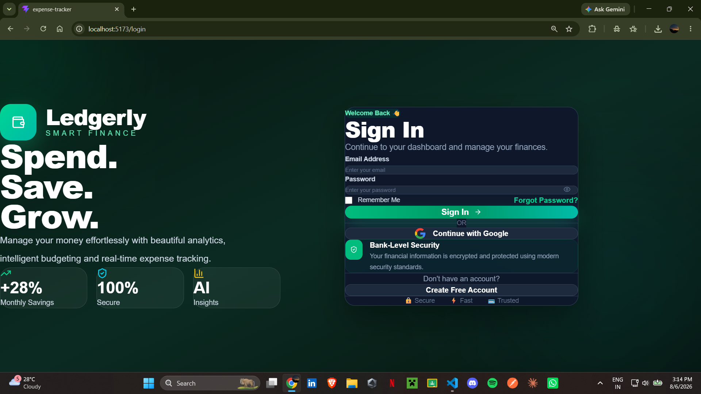
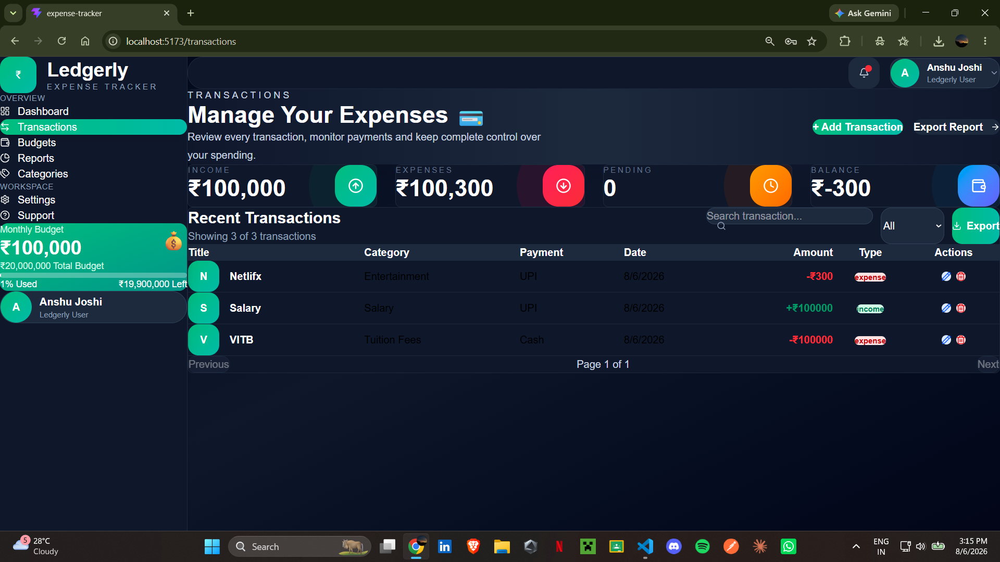
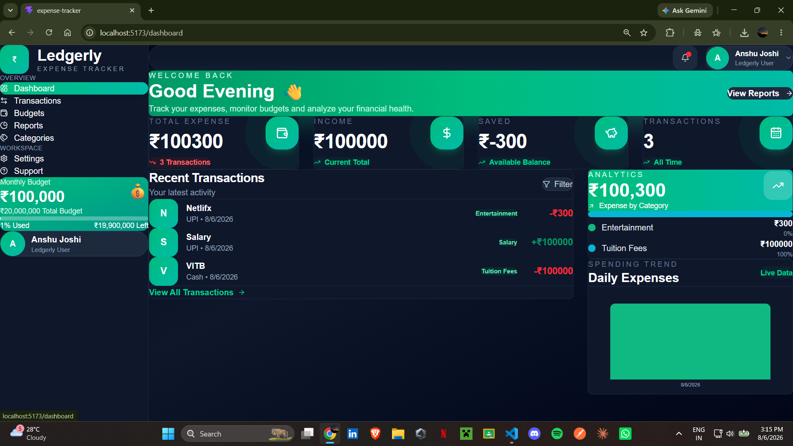
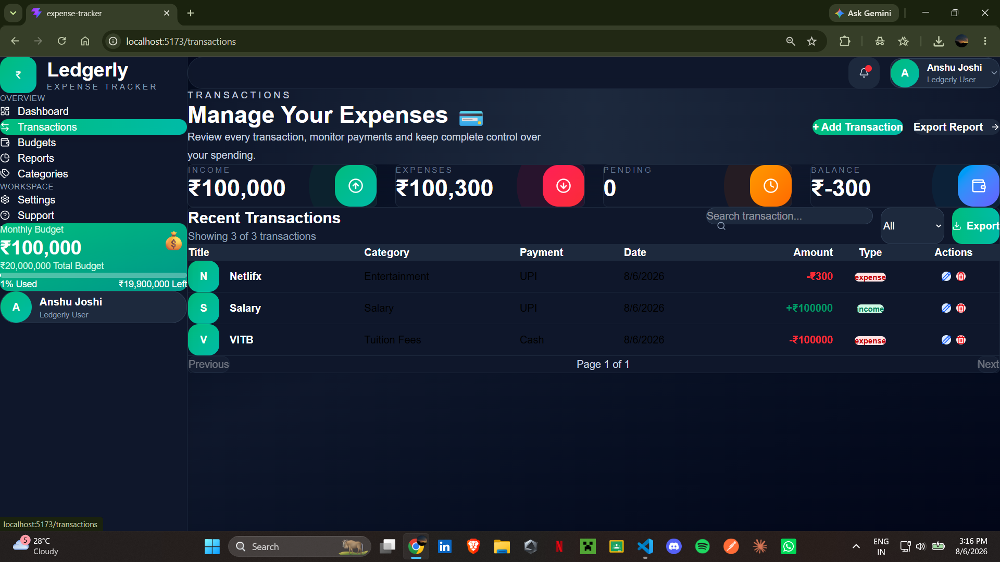
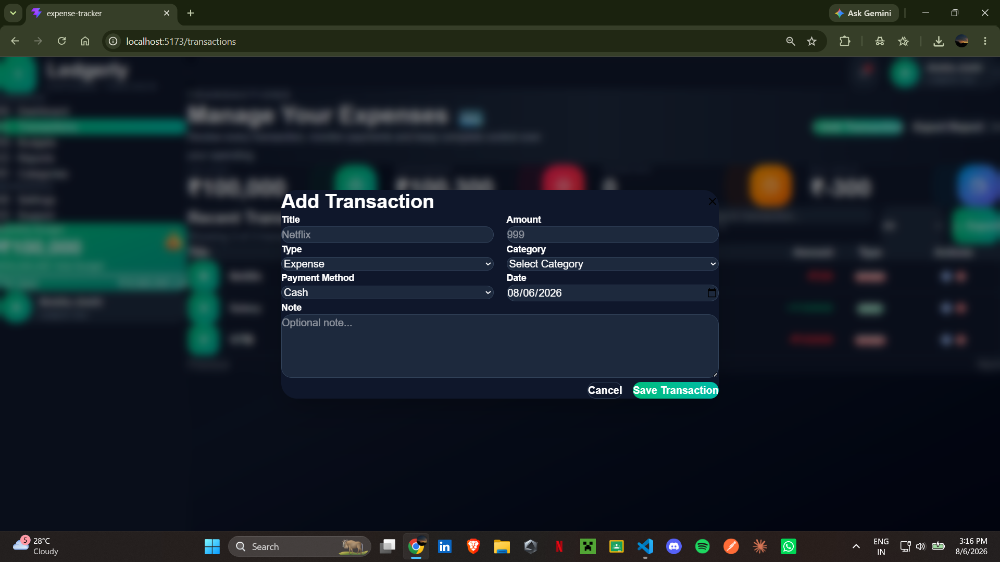
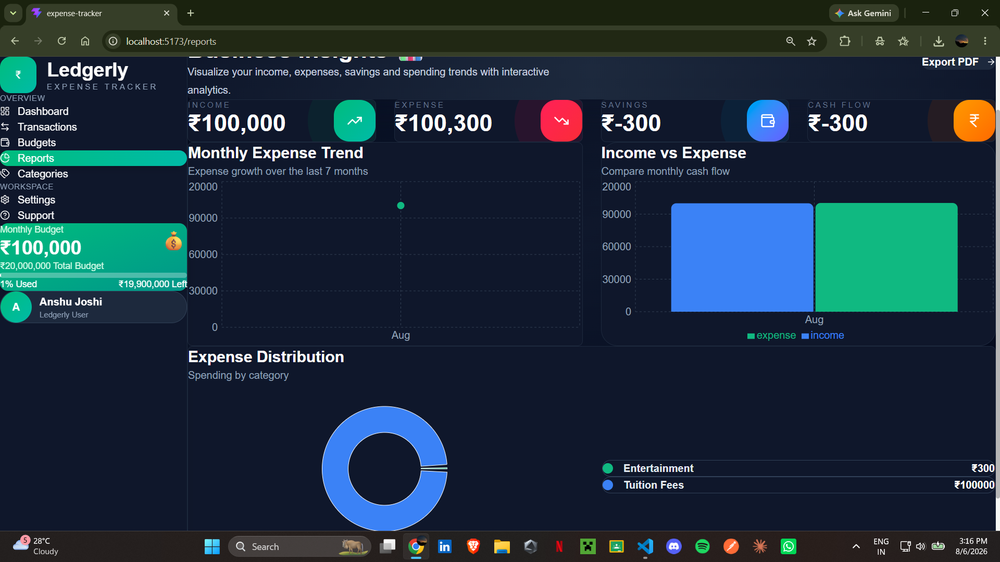

# 💰 Ledgerly – Smart Expense Tracker

Ledgerly is a modern full-stack MERN Expense Tracker that helps users manage their personal finances by tracking transactions, creating budgets, analyzing spending patterns, and generating financial reports.

Built with a clean UI, secure authentication, responsive design, and real-time financial insights.

---

## 🚀 Features

### 🔐 Authentication
- User Registration
- Secure Login
- JWT Authentication
- Protected Routes
- Logout

### 📊 Dashboard
- Financial Overview
- Total Income
- Total Expenses
- Current Balance
- Budget Summary
- Recent Transactions
- Quick Navigation

### 💳 Transactions
- Add Transaction
- Edit Transaction
- Delete Transaction
- Search Transactions
- Filter Transactions
- Pagination
- CSV Export

### 🏷️ Categories
- Create Categories
- Edit Categories
- Delete Categories
- Search Categories

### 💰 Budget Management
- Create Monthly Budgets
- Track Spending
- Remaining Budget
- Budget Progress Bar
- Automatic Expense Synchronization

### 📈 Reports
- Financial Analytics
- Charts & Graphs
- PDF Report Export

### ⚙️ Settings
- Dark Mode
- User Profile
- Account Preferences

### 🆘 Support
- Contact Support Form
- Interactive FAQ Section

---

# 🛠 Tech Stack

## Frontend
- React.js
- Vite
- Tailwind CSS
- React Router DOM
- React Query
- Axios
- React Hot Toast
- Lucide React
- Recharts

## Backend
- Node.js
- Express.js
- MongoDB
- Mongoose
- JWT Authentication
- bcrypt.js

---

# 📁 Project Structure

```
Ledgerly/
│
├── Backend/
│   ├── config/
│   ├── controllers/
│   ├── middleware/
│   ├── models/
│   ├── routes/
│   ├── utils/
│   ├── server.js
│   └── .env
│
├── Frontend/
│   ├── public/
│   ├── src/
│   │   ├── assets/
│   │   ├── components/
│   │   ├── context/
│   │   ├── hooks/
│   │   ├── layouts/
│   │   ├── pages/
│   │   ├── services/
│   │   └── App.jsx
│   └── vite.config.js
│
└── README.md
```

---

# ⚡ Installation

## Clone Repository

```bash
git clone https://github.com/your-username/ledgerly.git
```

---

## Backend Setup

```bash
cd Backend
npm install
```

Create a `.env` file

```env
PORT=5000

MONGO_URI=YOUR_MONGODB_URI

JWT_SECRET=YOUR_SECRET_KEY
```

Run backend

```bash
npm run dev
```

---

## Frontend Setup

```bash
cd Frontend
npm install
npm run dev
```

Frontend runs on

```
http://localhost:5173
```

Backend runs on

```
http://localhost:5000
```

---

# 📸 Screenshots









- Dashboard
- Transactions
- Budgets
- Reports
- Categories
- Settings
- Support

---

# ✨ Highlights

- Responsive UI
- Dark Mode
- Secure Authentication
- CRUD Operations
- Budget Tracking
- PDF Export
- CSV Export
- Search & Filters
- Real-time Dashboard
- Professional UI Design

---

# 🔮 Future Improvements

- Email Verification
- Password Reset
- Profile Image Upload
- Multi-Currency Support
- AI Expense Insights
- Recurring Transactions
- Monthly Notifications
- Cloud Storage
- Mobile App
- Google Authentication

---

# 👨‍💻 Author

**Anshu Joshi**

B.Tech CSE (AI & ML)

GitHub: https://github.com/your-username

LinkedIn: https://linkedin.com/in/your-profile

---

# 📜 License

This project is licensed under the MIT License.

---

⭐ If you found this project useful, consider giving it a star!